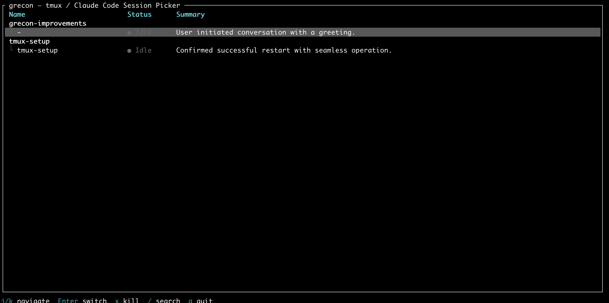

# grecon

A live session picker for [Claude Code](https://claude.ai/claude-code) in tmux.



## Why grecon?

### vs [Claude Squad](https://github.com/smtg-ai/claude-squad)

Different category of tool. Claude Squad is a terminal IDE that abstracts over tmux. Grecon is a picker.

- **Claude Squad takes over your terminal.** Sessions run in a tiny embedded window. Grecon lets you use full-size tmux panes.
- **Claude Squad is prescriptive.** It manages session creation, worktrees, branches. Grecon works with whatever tmux layout you already have.
- **Claude Squad manages state.** `~/.claude-squad/state.json`, a `worktrees/` directory, which can get out of sync. Grecon is stateless.
- **Grecon adds** AI summaries, background task tracking, subagent visibility, wakeup countdowns, custom tags.

### vs [recon](https://github.com/craftzdog/tmux-claude-session-manager)

Grecon is a fork of recon, which shares the same tmux companion philosophy.

- **Instant startup.** Recon scans on launch (1-2s). Grecon has a background server with data ready.
- **AI summaries.** One-line Haiku summaries. Recon shows raw info.
- **Live status.** Working, idle, or waiting for input. Recon doesn't detect this.
- **Background tasks and subagents.** Running commands, monitors, sub-agents, wakeup countdowns.
- **Custom tags.** `@grecon/*` tmux session options displayed in the picker.

## Getting started

```bash
go install github.com/mavenraven/grecon@v1.0.0-rc1
grecon server &
```

Add to `~/.tmux.conf`:

```bash
bind g run-shell 'tmux kill-session -t _grecon 2>/dev/null; \
  tmux new-session -d -s _grecon grecon; \
  tmux switch-client -t _grecon'
```

### Custom tags

```bash
tmux set @grecon/env "production"
tmux set @grecon/team "platform"
```

### Session persistence

Use [tmux-resurrect](https://github.com/tmux-plugins/tmux-resurrect), [tmux-continuum](https://github.com/tmux-plugins/tmux-continuum), and [tmux-assistant-resurrect](https://github.com/timvw/tmux-assistant-resurrect) to persist Claude sessions across reboots.

## License

MIT
